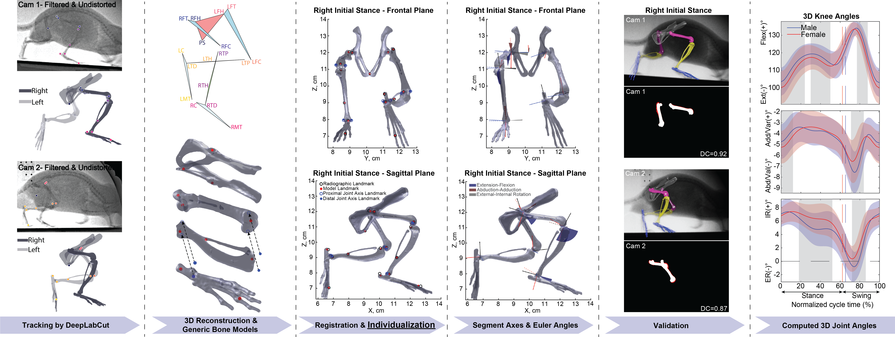

# Rat-Hindlimb-XRAY-3D


**Automatic Registration of Generic Bone Models for X-Ray-Based Biomechanics: Application to 3D Rat Hindlimb Kinematics and Sex-Specific Gait Patterns**

This repository provides MATLAB and Python code for reconstructing 3D rat hindlimb skeletal kinematics from biplanar X-ray videos. The workflow is markerless and scan-free: it uses radiographic landmarks detected in two X-ray views, reconstructs them in 3D, registers generic rat hindlimb bone models to those landmarks, and computes hip, knee, and ankle kinematics across the gait cycle.

<p align="center">
  
</p>

## Workflow overview

The pipeline is designed for high-throughput small-animal biomechanics where subject-specific CT scans, implanted markers, manual rotoscoping, and DRR-based registration can slow analysis. The main steps are:

1. Track 2D radiographic landmarks in paired X-ray views using DeepLabCut / DLCLive.
2. Import the 2D pixel coordinates into XMALab and reconstruct 3D landmark trajectories.
3. Register generic pelvis, femur, tibia, and foot models to the reconstructed landmarks using an SVD-based scaled Procrustes method.
4. Improve knee and ankle stability using joint-axis weighting and optional landmark pose refinement.
5. Compute segment coordinate systems and 3D Euler angles for the hip, knee, and ankle.
6. Validate registration error, visualize the results, and export transformed STL files.

The method uses 17 radiographic landmarks per view, generic OpenSim-derived bone models, anisotropic scaling, rotation, and translation, and optional pose refinement to reduce model-landmark mismatch. The output is a frame-by-frame 3D skeletal reconstruction of the rat hindlimb together with joint angle trajectories.

## Data and model availability

The complete data package and DLC models are hosted externally because the full dataset and trained model files are too large for regular GitHub storage.

**Full data package + DLC models:**  
https://drive.google.com/drive/folders/1Y4yuQJe1yPTSi3IsDnkiPrFfgBNiogX8?usp=drive_link

The GitHub repository contains a lightweight example data subset in:

```text
Data - GitHub/
```

## Important DLC walking-direction note

The distributed DLC model is intended for rats walking **from right to left** in the X-ray image.

For trials in which the rat walks **from left to right**:

1. Flip the X-ray videos before running DLC.
2. Run DLC on the flipped videos.
3. In XMALab, use the **original calibration** and **original undistortion images**.
4. In XMALab, import the **original videos**, not the flipped videos.
5. Enable the **flipped** option in XMALab.
6. Import the DLC-generated pixel coordinates produced from the flipped videos.

This keeps the original camera calibration and image geometry intact while allowing XMALab to handle the coordinate flip correctly.

## Repository layout

The intended GitHub repository structure is:

```text
Rat-Hindlimb-XRAY-3D/
├── Codes/                         MATLAB and Python source code
├── Data - GitHub/                 lightweight example dataset for GitHub
├── Results/                       processed example results and summary outputs
├── Supplementary materials/
│   ├── Gif/                       GIF previews used in this README
│   └── MP4/                       MP4 supplementary videos
├── Graphical_Abstract.png
├── README.md
├── LICENSE
├── .gitignore
└── .gitattributes
```

## Supplementary previews

### Landmark tracking - Supplementary Video 2, Male_7

Automatic detection and tracking of hindlimb radiographic landmarks in the paired X-ray views.

<p align="center">
  
</p>

[Open MP4](Supplementary%20materials/MP4/Supplementary%20Video%202%20-%20Male_7.mp4)

### Registration workflow - Supplementary Video 4, Male_7

Initial pose estimation, joint-axis weighting, landmark-based refinement, and registered bone visualization.

<p align="center">
  
</p>

[Open MP4](Supplementary%20materials/MP4/Supplementary%20Video%204%20-%20Male_7.mp4)

### Joint angle calculation - Supplementary Video 6, Male_7

Segment coordinate systems, local axes, and Euler-angle visualization for hip, knee, and ankle kinematics.

<p align="center">
  
</p>

[Open MP4](Supplementary%20materials/MP4/Supplementary%20Video%206%20-%20Male_7.mp4)

### X-ray and registered-bone comparison - Supplementary Video 8, Male_7

Comparison of the original X-ray videos with projections of the registered 3D bone models.

<p align="center">
  
</p>

[Open MP4](Supplementary%20materials/MP4/Supplementary%20Video%208%20-%20Male_7.mp4)

## Code guide

### Python / DLC to XMALab

| File | Purpose |
|---|---|
| `xray_rat_hindlimbXROMMTOOLS_Nathan.py` | Runs the trained DLC/DLCLive models on paired X-ray videos and converts the output to XMALab-compatible 2D labels. The original workflow was developed by Nathan J. Kirkpatrick and modified from xrommtools by J. D. Laurence-Chasen. The current repository adaptation and expanded model development were done by Seyed Mohammadali Rahmati. |

### Main MATLAB workflow

| File | Purpose |
|---|---|
| `B01_Registration_WithoutFlow_3DScale_WithMWF.m` | Main registration script. Loads 3D marker data and bone models, filters marker trajectories, registers generic bones to radiographic landmarks, applies marker weighting, and outputs transformed bone meshes/landmarks. |
| `B02_Plot_Filtered_Vs_Raw.m` | Compares raw and filtered marker trajectories. |
| `B02_Animation.m` | Creates 3D animations of registered bones. |
| `B03_Kinematics_3D_And_Cycles_R1_MLaxis.m` | Defines local segment coordinate systems and computes 3D hip, knee, and ankle Euler angles. |
| `B04_Animation_JointAxes.m` | Animates registered bones with local joint axes and optional marker display. |
| `B04_Stick_Animation_JointAxes.m` | Creates a simplified stick-model animation with joint axes. |
| `B05_Error_Computation.m` | Computes registration error between model landmarks and reconstructed radiographic landmarks. |
| `B06_STLWrite.m` | Exports transformed STL files for selected frames. |
| `B07_Visualize_STLFiles.m` | Visualizes the STL files exported by `B06_STLWrite.m`. |
| `B08_EulerCheck.m` | Visual check for segment axes, Euler-angle definitions, and angle patches. |
| `B09_Error_ROM_Sensitivity_to_MWF.m` | Tests sensitivity of registration error and stance ROM to the marker weighting factor. |

### Optimization and helper files

| File | Purpose |
|---|---|
| `O01_Optimization_Pattern.m` | Runs landmark pose-refinement optimization using pattern search. |
| `O02_Results.m` | Runs final analysis with optimized or default landmark locations. |
| `Cost_Function.m` | Objective function for optimization. |
| `Constraint_Function.m` | Optional nonlinear constraints for optimization. |
| `PatternSearch.m` | Wrapper around MATLAB `patternsearch`. |
| `IPGenerateCode.m` | Optional `fmincon` / interior-point optimization wrapper. |
| `Right_Left_Femur.m`, `Right_Left_Tibia.m`, `Right_Left_Foot.m`, `Right_left_Pelvis.m` | Generate right/left model landmarks and STL structures from generic bone models and optimization parameters. |
| `rigid_transform_3D_MA.m` | SVD-based 3D registration function estimating rotation, translation, and diagonal scale. |
| `repeat_coordinates.m` | Repeats selected landmark rows to implement marker weighting. |
| `fit_and_plot_sphere.m` | Fits a sphere to selected femoral-head points to estimate the femoral-head center. |

## Recommended MATLAB run order

```matlab
B01_Registration_WithoutFlow_3DScale_WithMWF
B02_Plot_Filtered_Vs_Raw          % optional
B02_Animation                     % optional visualization
B03_Kinematics_3D_And_Cycles_R1_MLaxis
B04_Animation_JointAxes           % optional visualization
B04_Stick_Animation_JointAxes     % optional visualization
B05_Error_Computation
B06_STLWrite                      % optional STL export
B07_Visualize_STLFiles            % optional STL visualization
B08_EulerCheck                    % optional Euler-angle check
B09_Error_ROM_Sensitivity_to_MWF  % optional sensitivity analysis
```

For optional landmark pose refinement:

```matlab
O01_Optimization_Pattern
O02_Results
```

## Required software

- MATLAB R2023a or newer is recommended.
- MATLAB toolboxes used by parts of the workflow may include Signal Processing Toolbox, Optimization Toolbox, Global Optimization Toolbox, Image Processing Toolbox, and Statistics and Machine Learning Toolbox.
- Python environment with DeepLabCut / DLCLive and pandas for the DLC-to-XMALab conversion step.
- XMALab for stereo calibration, undistortion, and 3D landmark reconstruction.
- XROMM/MayaTools only for optional model-image overlay validation videos.

## Attribution

The Python DLC-to-XMALab conversion workflow preserves the original attribution to **Nathan J. Kirkpatrick** and xrommtools / J. D. Laurence-Chasen. The repository adaptation, expanded model development, MATLAB registration workflow, optimization scripts, and documentation were developed by **Seyed Mohammadali Rahmati** at the Comparative Neuromechanics Lab, Georgia Institute of Technology.

The expanded DLC model development used a larger training set than the original Kirkpatrick workflow, with approximately 1500 paired X-ray frames used in the current model-development process.

## Citation

If you use this repository, please cite the associated paper:

> Rahmati, S. M., Plemmons, M., Watermeier, R. C., Iyer, K., Sameni, R., Kaiser, J. M., Tsai, L.-C., & Chang, Y.-H. (2026). [Automatic registration of generic bone models for X-ray–based biomechanics: Application to 3D rat hindlimb kinematics and sex-specific gait patterns](https://doi.org/10.1016/j.compbiomed.2026.111783). *Computers in Biology and Medicine*, **213**, 111783.

**DOI:** [10.1016/j.compbiomed.2026.111783](https://doi.org/10.1016/j.compbiomed.2026.111783)

## License

This repository is released under the MIT License. See `LICENSE` for details.
